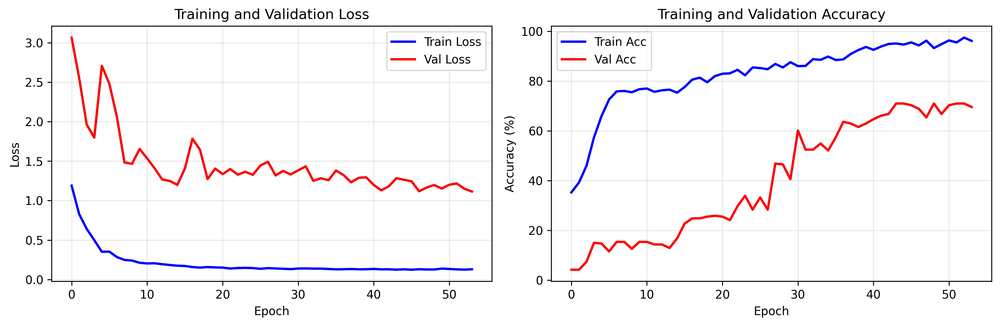
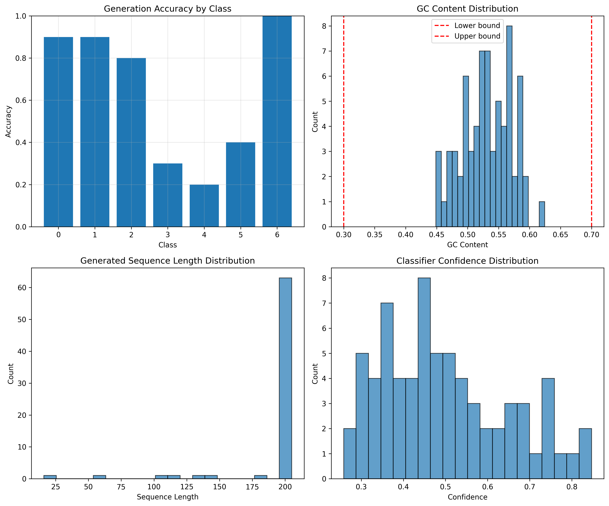

# VirtualDNA-Gen: AI-Generated DNA Sequences for Virtual Cells

## Project Overview

VirtualDNA-Gen is a computational biology framework designed for the conditional generation and functional classification of DNA sequences. The system employs a Mini-LLaMA architecture to synthesize biologically plausible DNA sequences tailored to specific functional categories, enabling in silico exploration of sequence-function relationships in virtual cellular environments.

The framework addresses the challenge of generating functionally coherent DNA sequences by integrating discriminative classification with autoregressive generation, constrained by biologically motivated sequence properties including nucleotide composition and structural complexity.

## Architecture

### Model Components

**DNA Classifier (Discriminator)**
- Mini-LLaMA-based classification architecture
- Incorporates RMSNorm, Rotary Positional Embedding (RoPE), and SwiGLU activation
- Depthwise separable convolutional feature extraction
- Global average pooling with attention masking
- Label smoothing regularization for improved generalization

**DNA Generator (Conditional Autoregressive Model)**
- Class-conditional sequence generation via class embedding injection
- Causal masking for autoregressive next-token prediction
- Top-k sampling with temperature control for sequence diversity
- Classifier-guided training through soft embedding backpropagation

### Data Processing Pipeline

**K-mer Tokenization**
- Custom vocabulary construction from observed k-mer subsequences
- Special token handling (<PAD>, <UNK>, <CLS>, <SEP>, <MASK>)
- Fixed-length sequence encoding with padding/truncation

**Biological Quality Filtering**
- Length constraints: 50-500 base pairs
- GC content filtering: 30%-70% threshold
- Sequence complexity validation: minimum unique k-mer diversity (10% of sequence length)
- Non-standard nucleotide removal

## Key Features

1. **Class-Imbalanced Learning**: WeightedRandomSampler with targeted class boosting for underrepresented functional categories
2. **Mixed Precision Training**: AMP-enabled training pipeline for computational efficiency
3. **Biological Constraints**: Multi-stage quality validation ensuring generated sequences conform to natural DNA properties
4. **Guided Generation**: Classifier feedback during generator training to maintain functional coherence
5. **Comprehensive Evaluation**: Multi-metric assessment including classification accuracy, GC content validity, and prediction confidence

## Installation

### Prerequisites

- Python 3.8 or higher
- CUDA-compatible GPU (recommended for training)

### Dependencies

```bash
pip install torch numpy pandas scikit-learn matplotlib seaborn tqdm
```

### Project Structure

```
VirtualDNA-Gen/
├── data/
│   └── human.txt              # Input DNA sequence dataset
├── output/
│   ├── model_checkpoints/     # Saved model weights
│   ├── training_plots/        # Training convergence visualizations
│   ├── generated_seqs/        # Generated sequences and evaluation
│   └── final_report.json      # Experiment summary
├── VirtualDNA_Gen.py          # Main execution script
└── README.md                  # Project documentation
```

## Data Acquisition

The dataset used in this project is the **DNA Sequence Dataset** (Human genomic sequences). You can obtain the data using the following methods:

### 1. Automated Download (via Kaggle API)
If you have the `kagglehub` library installed, you can fetch the dataset programmatically:

```python
import kagglehub
path = kagglehub.dataset_download("nageshsingh/dna-sequence-dataset")
print(f"Dataset downloaded to: {path}")
```

## Usage

### Configuration

Hyperparameters are centrally defined in the `Config` class:

```python
class Config:
    data_path = "data/human.txt"
    k_mer = 6
    max_seq_len = 200
    embed_dim = 128
    num_heads = 8
    num_layers = 4
    batch_size = 128
    learning_rate = 1e-2
    epochs = 80
    generation_temperature = 0.7
    top_k = 2
```

### Execution

Run the complete training and generation pipeline:

```bash
python VirtualDNA_Gen.py
```

The pipeline executes the following stages:

1. **Data Loading and Preprocessing**: Sequence filtering, class encoding, and dataset splitting
2. **Classifier Training**: Supervised training with class-balanced sampling
3. **Generator Training**: Conditional autoregressive training with classifier guidance
4. **Sequence Generation**: Top-k sampling for each functional class
5. **Post-hoc Evaluation**: Quality assessment and visualization
6. **Report Generation**: Structured JSON and text summaries

### Output Artifacts

- `output/model_checkpoints/best_classifier.pth`: Optimal classifier weights
- `output/training_plots/training_curves.png`: Loss and accuracy trajectories
- `output/generated_seqs/generated_sequences.fasta`: Synthetic DNA sequences
- `output/generated_seqs/generation_evaluation.csv`: Per-sequence quality metrics
- `output/training_plots/generation_results.png`: Generation quality visualizations
- `output/final_report.json`: Comprehensive experiment metadata

## Evaluation Metrics

### Classifier Performance

- **Validation Accuracy**: Classification performance on held-out test set
- **Class-wise F1 Score**: Per-category precision-recall balance
- **Training Convergence**: Loss trajectory and early stopping behavior

### Generation Quality

- **Class Attribution Accuracy**: Percentage of generated sequences correctly classified into target functional category
- **GC Content Validity**: Proportion of sequences within biologically plausible GC range (30%-70%)
- **Sequence Length Distribution**: Comparison of generated vs. natural sequence length profiles
- **Nucleotide Composition**: Deviation from expected base frequencies
- **Classifier Confidence**: Prediction certainty distribution for generated sequences

### Biological Plausibility

- **Nucleotide Balance**: A/T vs. C/G composition consistency
- **K-mer Diversity**: Unique subsequence richness
- **Structural Constraints**: Absence of homopolymeric runs and repetitive artifacts

## Experimental Performance

The framework was evaluated on a human genomic dataset. After rigorous biological filtering (GC content 30-70%, complexity validation), 1,429 high-quality sequences were retained for the core experiment.

### Training Dynamics

The Mini-LLaMA classifier demonstrated stable convergence over the training period.

- **Final Validation Accuracy**: 69.58%

### Generative Quality Assessment

The generator synthesized DNA sequences across multiple functional classes with the following biological fidelity:

- **Synthetic Sequence Accuracy**: 64.29% (Average class attribution score)
- **Biological Validity (GC Content)**: 100.00% of generated sequences successfully fell within the biologically plausible range (0.3 - 0.7)
- **Structural Consistency**: The generated sequences maintain a mean GC content of 0.53, closely mimicking the natural human genomic distribution

### Visual Diagnostics


*Figure 1: Loss and Accuracy trajectories showing stable model convergence.*


*Figure 2: Multi-dimensional evaluation of generated DNA sequences.*

Comprehensive evaluation plots are generated automatically in `output/training_plots/`:

- **Generation Accuracy by Class**: Visualizes the model's performance across different functional categories, with Class 6 reaching the highest attribution accuracy
- **GC Content Distribution**: Confirms that synthetic sequences follow a Gaussian-like distribution, avoiding non-biological extreme values
- **Classifier Confidence**: The distribution shows that the majority of generated sequences were predicted with high confidence scores, peaking between 0.4 and 0.9
- **Sequence Length Distribution**: Confirms the generator's ability to produce consistent 200bp sequences as defined in the configuration

## Citation

If you utilize this framework in your research, please cite appropriately.

## License

This project is provided for academic research purposes.
